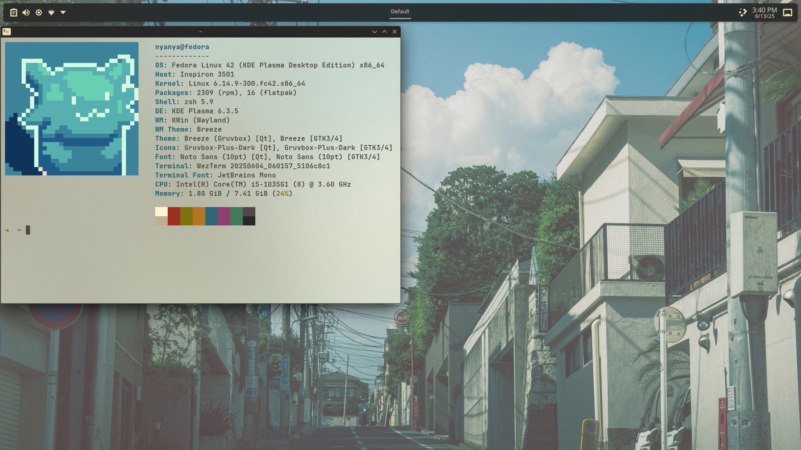

# My personal dotfiles on Linux



## ⚠️ WARNING

Please fork this repository if you want to customize it on your own.

## Prerequisites

- [zsh](https://github.com/ohmyzsh/ohmyzsh/wiki/Installing-ZSH)
- libfuse library (depends on the distro)

## Installation

Clone this repository:
```
git clone https://github.com/Yncy0/wsl-dev-setup.git ~/.linux-dev-setup
```

If using SSH:
```
git clone git@github.com:Yncy0/linux-dev-setup.git ~/.linux-dev-setup && cd
```

Run the script:
```
cd ~/.linux-dev-setup && chmod +x setup.sh && ./setup.sh
```

## ZSH
If you wanted zsh to be your default shell, or just in case it doesn't switch automatically, just run:

```
source ~/.zshrc
chsh -s $(which zsh)
```

If oh-my-zsh not showing, run this line:
```
zsh
```
⚠️ *You might want to restart your terminal or reboot the system to apply the changes.*


## Project Structure
You can easily **stow** necessary files.
```
├── .config
│   ├── fastfetch
│   ├── nvim
│   ├── tmux
│   └── wezterm
├── .gitignore
├── README.md
├── screenshot.png
├── setup.sh
└── zsh
```

*Please if you have problems, contact me on my GitHub account: Yncy0, or open an issue on this repository. Thanks!*
