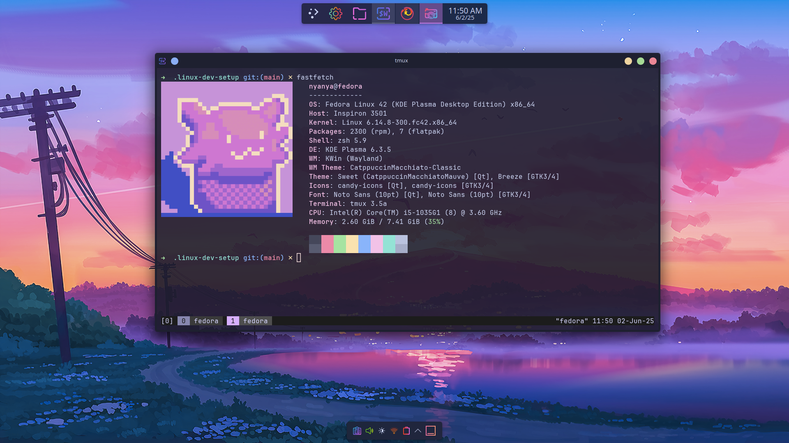

# My personal dotfiles on Linux



> ⚠️ WARNING: Please fork this repository if you want to customize it on your own.

## Prerequisites

- [zsh & oh-my-zsh](https://github.com/ohmyzsh/ohmyzsh/wiki/Installing-ZSH)
- fuse/libfuse library
- stow
- curl

If you are on **WSL**, it is pretty much likely that you don't have ~/.config file yet, run this:
```
mkdir ~/.config
```

> ⚠️ WARNING: setup.sh is not completed yet

## Installation

Clone this repository:
```
git clone https://github.com/Yncy0/dotfiles.git ~/.dotfiles
```

If using SSH:
```
git clone git@github.com:Yncy0/dotfiles ~/.dotfiles && cd
```

Run the script:
```
cd ~/.dotfiles chmod +x setup.sh && ./setup.sh
```

## Primarly Used Packages

- 📁[alacritty](https://github.com/yncy0/dotfiles/tree/main/alacritty)         - for terminal
- 📁[fastfetch](https://github.com/yncy0/dotfiles/tree/main/fastfetch)         - for displaying your Linux
- 📁[hypr](https://github.com/yncy0/dotfiles/tree/main/hypr)                   - for window tiling manager
- 📁[nvim](https://github.com/yncy0/dotfiles/tree/main/nvim)                   - for the best code text editor
- 📁[swaync](https://github.com/yncy0/dotfiles/tree/main/swaync)               - for notifications
- 📁[tmux](https://github.com/yncy0/dotfiles/tree/main/tmux)                   - for terminal emulator
- 📁[wallpapers](https://github.com/yncy0/dotfiles/tree/main/wallpapers)       - for wallpapers
- 📁[waybar](https://github.com/yncy0/dotfiles/tree/main/waybar)               - for the status bar
- 📁[wofi](https://github.com/yncy0/dotfiles/tree/main/wofi)                   - for app launcher
- 📁[zsh](https://github.com/yncy0/dotfiles/tree/main/zsh)                     - for my default shell

> Those that I didn't mentioned, I'm not using them anymore.
